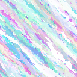

# ScreenShoter

<p align="center">
  
</p>

## 📝 项目简介

ScreenShoter是一个轻量级的 Chrome 浏览器扩展，允许在网页上选择任意 DOM 元素并快速生成截图。

## ✨ 主要特点

- 🎯 精确选择：鼠标悬停即可选中网页上任意 DOM 元素
- 📸 一键截图：点击选中的元素即可截图
- 🖼️ 自定义边距：可设置截图边距，确保截图内容完整呈现
- 💾 自动保存：截图完成后自动下载到本地
- 🔍 高质量输出：支持图像质量增强，提供更清晰的截图效果
- ⚙️ 可配置选项：支持自定义截图边距、延迟和质量增强因子

## 📦 安装指南

### 手动安装

1. 下载此代码库的 ZIP 文件或使用 Git 克隆
   ```bash
   git clone https://github.com/DearVinking/screenshoter.git
   ```
2. 在 Chrome 浏览器中打开 `chrome://extensions/`
3. 开启右上角的"开发者模式"
4. 点击"加载已解压的扩展程序"按钮
5. 选择项目文件夹

## 🚀 使用方法

1. 点击浏览器工具栏中的扩展图标
2. 鼠标移动到网页上，会有蓝色虚线框高亮当前悬停的 DOM 元素
3. 左键点击选中的元素进行截图
4. 截图会自动下载保存到您的默认下载文件夹
5. 如需取消操作，可以右键点击

## 🛠️ 技术实现

- 使用原生 JavaScript 实现，无需额外依赖库
- 基于 Chrome 扩展的 Manifest V3 规范开发
- 利用 Chrome 的 captureVisibleTab API 进行页面截图
- 使用 OffscreenCanvas 进行图像处理和质量增强
- 支持高 DPI 屏幕的适配，确保截图清晰度

## ⚙️ 配置选项

通过点击扩展图标旁的"扩展选项"或右键扩展图标选择"选项"可以打开配置页面，可以调整以下参数：

- **截图边距设置（px）**：选中元素的周围边距（默认：10px）
- **截图延迟时间（ms）**：点击后延迟截图的时间（默认：100 毫秒）
- **质量增强因子**：图像尺寸扩大的倍数，1.0 为原始尺寸（默认：2.0）

## 📋 权限说明

本扩展需要以下权限：

- `activeTab`：访问当前标签页
- `scripting`：在当前页面执行脚本
- `downloads`：保存截图到本地
- `storage`：存储扩展配置
- `host_permissions`：允许在所有网站上使用

## 📄 许可证

MIT
